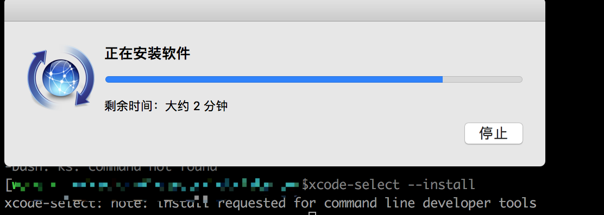

# Mac 报错 xcrun: error

### 更新 Mac 之后提交 git 报错：

```
xcrun: error: invalid active developer path (/Library/Developer/CommandLineTools), missing xcrun at: /Library/Developer/CommandLineTools/usr/bin/xcrun
```

### 自问

- 是否已从 App Store 升级到 OS X El Capitan ？
- 是否突然开始在项目中收到以上错误？

如果是那么解决方案就很简单了，只需要执行：

```
xcode-select --install
```



安装成功就可以。

### git 是否有问题

查看 git 是否安装成功

```
which git
```

如果没有安装，只需要装好久可以了

```
brew install git
```
