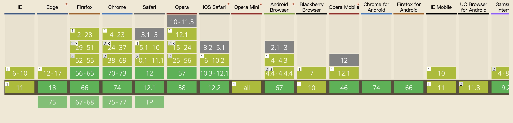
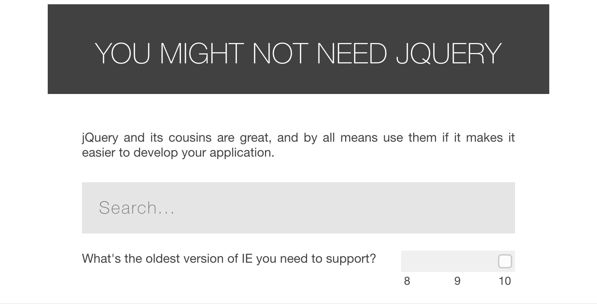

# 常用工具

## 图片转换

<ClientOnly>
  <base64Canvas/>
</ClientOnly>

[Exif.js](http://code.ciaoca.com/javascript/exif-js/)提供了 JavaScript 读取图像的原始数据的功能扩展，例如：拍照方向、相机设备型号、拍摄时间、ISO 感光度、GPS 地理位置等数据。

[canvas2svg](https://github.com/gliffy/canvas2svg)使用 javascript 将您的 Canvas 转换为 SVG。换句话说，这个库允许您使用 canvas api 构建 SVG 文档。

[SVGCanvas](http://svgkit.sourceforge.net/SVGCanvas.html)是大多数 Canvas 绘图 API 的 JavaScript 实现，它创建 SVG 图形元素而不是绘制到像素缓冲区。

## CSS 动画

[简单的 CSS 动画](https://cssfx.dev/)，可以直接点击复制 CSS 效果。

## Animation.css

<ClientOnly>
  <animation/>
</ClientOnly>

### animation 参数详情

| 值                        | 描述                                                                                                                                                                                                                                                                                                                 |
| ------------------------- | -------------------------------------------------------------------------------------------------------------------------------------------------------------------------------------------------------------------------------------------------------------------------------------------------------------------- |
| animation-timing-function | `linear` 动画从头到尾的速度是相同的。    `ease` 默认。动画以低速开始，然后加快，在结束前变慢    `ease-in` 动画以低速开始。   `ease-out` 动画以低速结束。   `ease-in-out` 动画以低速开始和结束。   `cubic-bezier(n,n,n,n)` 在 cubic-bezier 函数中自己的值。可能的值是从 0 到 1 的数值。 |
| animation-iteration-count | `infinite` 规定动画无限次播放    `n` 定义动画播放次数的数值。                                                                                                                                                                                                                                                  |
| animation-direction       | 规定是否应该轮流反向播放动画。 `alternate`                                                                                                                                                                                                                                                                           |
| animation-fill-mode       | 属性规定当动画不播放时（当动画完成时，或当动画有一个延迟未开始播放时），要应用到元素的样式    `forwards` 在动画结束后（由 animation-iteration-count 决定），动画将应用该属性值。                                                                                                                         |

## TinyPNG

TinyPNG 使用智能有损压缩技术来减少 PNG 文件的文件大小。通过选择性地减少图像中的颜色数量，存储数据所需的字节更少。效果几乎是不可见的，但它在文件大小上产生了很大的差异！

## Can I use

“Can I use”提供最新的浏览器支持表，以支持桌面和移动 Web 浏览器上的前端 Web 技术。

"Can I use" provides up-to-date browser support tables for support of front-end web technologies on desktop and mobile web browsers.

## jQuery 做的事

如果你正在开发一个库，请花点时间考虑一下你是否真的需要 jQuery 作为依赖。也许您可以包含几行实用程序代码，并忘记了要求。如果您只定位更多现代浏览器，则可能不需要浏览器附带的内容。

## 欢迎评论

<!-- 评论 -->
<ClientOnly>
  <livere/>
</ClientOnly>
